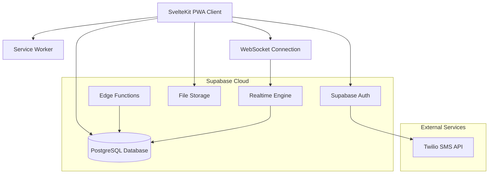

# QryptChat - Quantum-Resistant Chat Application Architecture

## Overview
QryptChat is a quantum-resistant, end-to-end encrypted messaging application built as a Progressive Web App (PWA) using SvelteKit 5, Supabase Cloud, and post-quantum cryptography.

## Technology Stack

### Frontend
- **Framework**: SvelteKit (latest) with Svelte 5
- **Styling**: Vanilla CSS with CSS Grid/Flexbox
- **PWA**: Service Worker + Web App Manifest
- **Real-time**: Native WebSockets
- **Build Tool**: Vite (included with SvelteKit)

### Backend
- **Database**: Supabase Cloud (PostgreSQL)
- **Authentication**: Supabase Auth + Twilio SMS
- **Real-time**: Supabase Realtime + WebSocket fallback
- **File Storage**: Supabase Storage (for media)
- **Edge Functions**: Supabase Edge Functions (Deno)

### Cryptography
- **Key Exchange**: CRYSTALS-Kyber (NIST PQC standard)
- **Digital Signatures**: CRYSTALS-Dilithium (NIST PQC standard)
- **Symmetric Encryption**: ChaCha20-Poly1305 (for message content)
- **Key Derivation**: HKDF with SHA-256
- **Random Generation**: Web Crypto API

## System Architecture

## Database Schema

### Core Tables
- **users**: User profiles and public keys
- **conversations**: Chat conversations (1:1 and groups)
- **messages**: Encrypted message storage
- **conversation_participants**: Many-to-many relationship
- **contacts**: User contact relationships
- **device_keys**: Per-device key pairs for multi-device support

### Security Tables
- **key_bundles**: Pre-keys for new conversations
- **message_keys**: Ephemeral keys for forward secrecy
- **verification_codes**: SMS verification storage

## Security Model

### Key Management
1. **Identity Keys**: Long-term CRYSTALS-Dilithium key pairs per user
2. **Ephemeral Keys**: CRYSTALS-Kyber key pairs for each conversation
3. **Message Keys**: ChaCha20 keys derived from shared secrets
4. **Forward Secrecy**: Keys rotated regularly, old keys deleted

### Message Flow
1. Client generates ephemeral key pair
2. Key exchange using CRYSTALS-Kyber
3. Derive symmetric key using HKDF
4. Encrypt message with ChaCha20-Poly1305
5. Sign with CRYSTALS-Dilithium
6. Store encrypted in database

## PWA Features
- **Offline Support**: Service Worker caches for offline messaging
- **Push Notifications**: Web Push API for message alerts
- **Install Prompt**: Add to home screen functionality
- **Background Sync**: Queue messages when offline

## Real-time Communication
- **Primary**: Supabase Realtime for message delivery
- **Fallback**: Direct WebSocket connection
- **Presence**: Online/offline status tracking
- **Typing Indicators**: Real-time typing status

## Contact Management
- **Phone Verification**: Twilio SMS OTP
- **Contact Discovery**: Hash-based phone number matching
- **Privacy**: No plaintext phone numbers stored
- **Invitations**: SMS invites to non-users

## Group Features
- **Max Size**: 100 participants
- **Admin Roles**: Creator, admin, member hierarchy
- **Permissions**: Message, add members, change settings
- **Group Keys**: Shared group encryption keys
- **Member Management**: Add/remove with proper key rotation

## Performance Considerations
- **Lazy Loading**: Messages loaded on demand
- **Virtual Scrolling**: Efficient large conversation rendering
- **Image Optimization**: WebP format with compression
- **Bundle Splitting**: Code splitting for optimal loading
- **CDN**: Supabase CDN for global performance

## Deployment Architecture
- **Frontend**: Static hosting via Supabase or Vercel
- **Database**: Supabase Cloud (multi-region)
- **Edge Functions**: Deployed to Supabase Edge Runtime
- **Monitoring**: Supabase Analytics + custom metrics