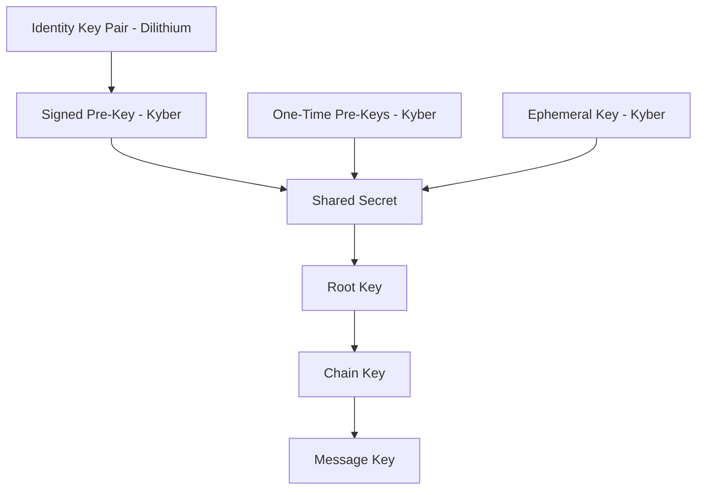
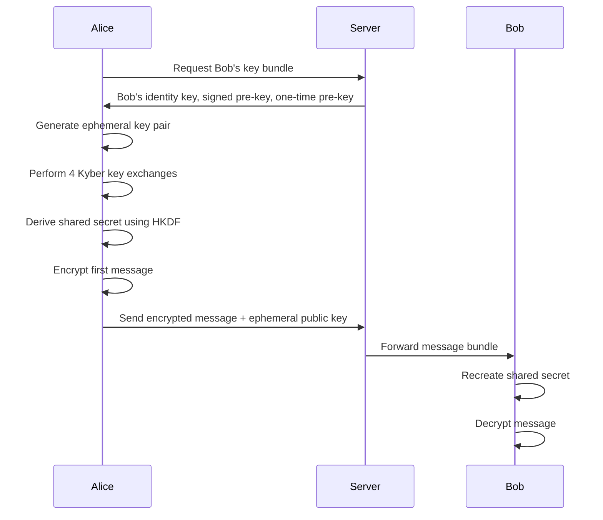
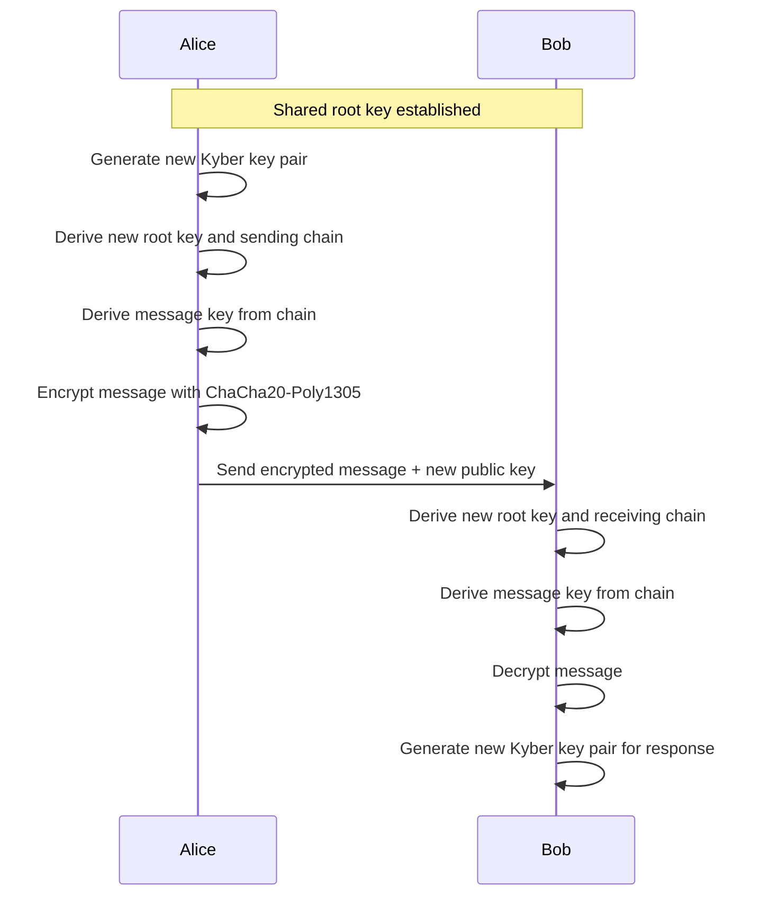

# QryptChat - Quantum-Resistant Encryption Implementation

## Overview
QryptChat implements post-quantum cryptography to ensure message security against both classical and quantum computer attacks. All encryption happens client-side before data leaves the device.

## Post-Quantum Cryptographic Algorithms

### Key Encapsulation Mechanism (KEM)
- **Algorithm**: CRYSTALS-Kyber-1024
- **Purpose**: Secure key exchange between clients
- **Key Size**: 1,568 bytes (public), 3,168 bytes (private)
- **Security Level**: NIST Level 5 (highest)
- **Implementation**: WebAssembly module via `pqc-kyber` library

### Digital Signatures
- **Algorithm**: CRYSTALS-Dilithium-5
- **Purpose**: Message authentication and non-repudiation
- **Key Size**: 2,592 bytes (public), 4,864 bytes (private)
- **Security Level**: NIST Level 5 (highest)
- **Implementation**: WebAssembly module via `pqc-dilithium` library

### Symmetric Encryption
- **Algorithm**: ChaCha20-Poly1305
- **Purpose**: Fast message content encryption
- **Key Size**: 256 bits
- **Nonce**: 96 bits (unique per message)
- **Authentication**: Built-in AEAD (Authenticated Encryption with Associated Data)

## Key Management Architecture

### Key Hierarchy

### Key Types

#### 1. Identity Keys (Long-term)
- **Type**: CRYSTALS-Dilithium key pair
- **Lifetime**: Permanent (until user resets)
- **Purpose**: User identity verification
- **Storage**: Encrypted in browser IndexedDB
- **Backup**: Encrypted backup to Supabase (optional)

#### 2. Signed Pre-Keys (Medium-term)
- **Type**: CRYSTALS-Kyber key pair
- **Lifetime**: 30 days (rotated automatically)
- **Purpose**: Initial key exchange
- **Signature**: Signed by Identity Key
- **Storage**: Public key on server, private key local

#### 3. One-Time Pre-Keys (Short-term)
- **Type**: CRYSTALS-Kyber key pairs
- **Lifetime**: Single use
- **Purpose**: Perfect forward secrecy
- **Quantity**: 100 keys generated per batch
- **Storage**: Public keys on server, private keys local

#### 4. Ephemeral Keys (Per-message)
- **Type**: CRYSTALS-Kyber key pair
- **Lifetime**: Single message
- **Purpose**: Additional forward secrecy
- **Storage**: Not stored (generated on-demand)

## Message Encryption Flow

### 1. Initial Key Exchange (X3DH Protocol Adapted for PQC)

### 2. Ongoing Message Encryption (Double Ratchet Adapted for PQC)

## Security Properties

### Forward Secrecy
- **Message Keys**: Deleted immediately after use
- **Chain Keys**: Ratcheted forward, old keys deleted
- **One-Time Pre-Keys**: Used once and deleted
- **Ephemeral Keys**: Never stored

### Post-Compromise Security
- **Key Rotation**: Regular rotation of all key types
- **Healing**: New key exchanges heal from compromise
- **Isolation**: Compromise of one conversation doesn't affect others

### Quantum Resistance
- **NIST Standards**: Uses NIST-approved PQC algorithms
- **Security Levels**: Level 5 provides maximum quantum resistance
- **Future-Proof**: Designed for 50+ year security horizon

## Implementation Libraries

### WebAssembly Modules
- **pqc-kyber**: CRYSTALS-Kyber implementation
- **pqc-dilithium**: CRYSTALS-Dilithium implementation
- **Performance**: Native speed in browser
- **Security**: Constant-time implementations

### Web Crypto API
- **ChaCha20-Poly1305**: Native browser support
- **HKDF**: Key derivation functions
- **Random**: Cryptographically secure random numbers
- **Subtle Crypto**: Low-level cryptographic operations

## Security Considerations

### Side-Channel Attacks
- **Constant-Time**: All operations use constant-time algorithms
- **Memory**: Secure memory clearing after use
- **Timing**: No timing-dependent operations

### Implementation Security
- **Code Review**: All cryptographic code reviewed
- **Testing**: Extensive unit and integration tests
- **Auditing**: Regular security audits planned
- **Updates**: Automatic security updates

### Threat Model
- **Quantum Computers**: Resistant to Shor's and Grover's algorithms
- **Nation-State Actors**: Designed for highest threat level
- **Long-Term Security**: 50+ year security horizon
- **Compromise Recovery**: Automatic healing from key compromise